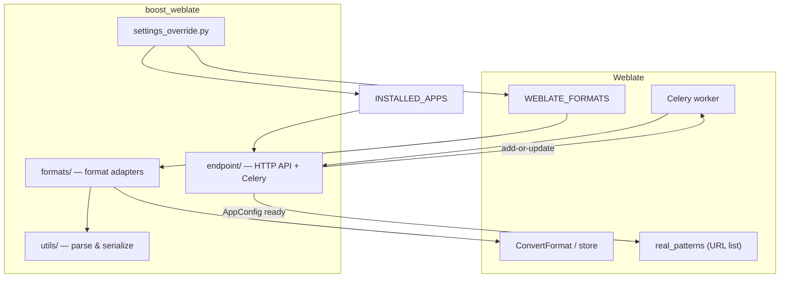

<!--
SPDX-FileCopyrightText: 2026 Andrew Zhang <whisper67265@outlook.com>

SPDX-License-Identifier: BSL-1.0
-->

# cppa-weblate-plugin

## Overview

**cppa-weblate-plugin** is a small Python package (`boost_weblate` on import, `cppa-weblate-plugin` on PyPI) that extends [Weblate](https://weblate.org/) with formats needed for **Boost C++ Libraries** documentation translation. Today it implements **QuickBook** (`.qbk`): a monolingual convert pipeline that extracts translatable prose into Gettext-style workflows and writes translations back into the original template.

**Why a plugin instead of a Weblate fork?** A fork must be rebased across upstream security fixes, releases, and dependency changes. Shipping **stock Weblate** (PyPI or the official image) plus this plugin keeps you on the supported upgrade path while still teaching Weblate how to parse and serialize QuickBook. Customization lives in versioned Python code and a single settings hook, not in a divergent Weblate tree.

**Supported formats**

| Format     | Module | Status   |
| ---------- | ------ | -------- |
| QuickBook  | `boost_weblate.formats.quickbook` | Implemented |

Additional formats should follow the same split: a thin class under `src/boost_weblate/formats/` that plugs into Weblate's format APIs, with parsing and reconstruction under `src/boost_weblate/utils/`.

## Quick Start

### Local development

```bash
git clone https://github.com/cppalliance/cppa-weblate-plugin.git
cd cppa-weblate-plugin
uv venv
source .venv/bin/activate
uv pip install -e '.[dev]'
pytest
```

### Docker (CI stack)

Build the full Weblate + PostgreSQL + Redis stack locally using the CI Compose file:

```bash
docker compose -f docker/docker-compose.ci.yml build
docker compose -f docker/docker-compose.ci.yml up -d
```

Weblate is available at `http://localhost:8080` once the healthcheck passes (admin / `admin`). The CI stack uses ephemeral Postgres on tmpfs — data does not persist across restarts.

### Docker (CD / staging and production)

For persistent deployment with host PostgreSQL and shared Redis, see [docs/deployment-runbook.md](docs/deployment-runbook.md) (staging auto-deploy on `develop`, production via promote + `main` deploy). Quick version:

```bash
cp .env.example .env          # fill in secrets; see .env.example comments
docker compose -f docker/docker-compose.cd.yml --env-file .env build
docker compose -f docker/docker-compose.cd.yml --env-file .env up -d
```

## Architecture

Weblate discovers formats by **import path** (see [WEBLATE_FORMATS config](#weblate_formats-configuration)). This repository keeps a clear boundary between "what Weblate sees" and "how a file format works."



- **`src/boost_weblate/settings_override.py`** — Docker `exec()` fragment: sets `WEBLATE_FORMATS` and appends `BoostEndpointConfig` to `INSTALLED_APPS`. Copied to `/app/data/settings-override.py` by the Dockerfile. See [WEBLATE_FORMATS configuration](#weblate_formats-configuration) and [WEBLATE_ADD_APPS](#weblate_add_apps).

- **`src/boost_weblate/formats/`** — Weblate-facing **format classes** (subclasses of Weblate's `BaseFormat` family, such as `weblate.formats.convert.ConvertFormat`). `QuickBookFormat` follows the same pattern as built-in convert formats (for example AsciiDoc): it turns a template file into a translation store and, on save, applies translations back using the template plus the store.

- **`src/boost_weblate/utils/`** — **Format-specific logic** with no Weblate import cycle: QuickBook parsing, segment extraction, translate-toolkit storage (`QuickBookFile` / `QuickBookUnit`), and reconstruction (`QuickBookTranslator`). New formats should add a sibling module (or package) here.

- **`src/boost_weblate/endpoint/`** — **HTTP API** for Boost documentation project/component management. Exposes three routes under `/boost-endpoint/` (see [Boost endpoint routes](#boost-endpoint-routes)), uses Django REST Framework for auth and serialization, and hands off heavy work to a Celery task (see [Celery requirement for add-or-update](#celery-requirement-for-add-or-update)).

- **`tests/`** — **Pytest** layout mirrors `src/boost_weblate/` (`tests/formats/`, `tests/utils/`, `tests/endpoint/`). Shared fixtures live under `tests/fixtures/`. `tests/conftest.py` configures `sys.path`, sets `DJANGO_SETTINGS_MODULE` to `tests.django_qbk_format_settings`, and calls `django.setup()` so format tests can load Weblate's Django stack without requiring PostgreSQL. Docker-based plugin tests live in `tests/plugin/`.

## WEBLATE_FORMATS configuration

Weblate discovers formats from the `WEBLATE_FORMATS` setting (see `FileFormatLoader` in upstream `weblate.formats.models`). The official Docker image evaluates a single optional file after base settings: if `/app/data/settings-override.py` exists, it is compiled and executed with `exec()` in the **same namespace** as the rest of `weblate.settings_docker`.

Stock `weblate.settings_docker` does **not** always bind `WEBLATE_FORMATS` in that namespace before the hook runs, so a bare `WEBLATE_FORMATS += (...)` in the override can raise `NameError`. This repository ships `src/boost_weblate/settings_override.py` as the Docker `exec()` fragment: it assigns `WEBLATE_FORMATS` by **reading** upstream `weblate/formats/models.py` and AST-parsing `FormatsConf.FORMATS` (aligned with the installed Weblate version, without importing `weblate.formats.models` during settings load, which can raise `AppRegistryNotReady`). It also appends the endpoint Django app to `INSTALLED_APPS` — see [`WEBLATE_ADD_APPS`](#weblate_add_apps) below.

**Operators:** ensure the plugin package is installed in the Weblate environment (`pip` / image layer), then install the override file where Weblate expects it. For the stock Docker layout:

```dockerfile
COPY settings-override.py /app/data/settings-override.py
```

That path is fixed; Weblate does not scan `DATA_DIR` for arbitrary override files. The override file is **not** the same as `WEBLATE_PY_PATH` / `python/customize` (importable customization on `sys.path`); for format registration, use this exec hook unless your image explicitly imports another settings module. See the comments in `settings_override.py` for the full distinction.

**Adding another format:** implement the class under `boost_weblate/formats/`, append its dotted class path in `weblate_formats_with_quickbook()` (or extend the tuple built there), redeploy, and restart Weblate. If upstream restructures `FormatsConf` in `models.py` (e.g. renames the class or moves `FORMATS` off a simple tuple assignment), update the AST helpers in `settings_override.py` accordingly.

## WEBLATE_ADD_APPS

`WEBLATE_ADD_APPS` is a Weblate Docker environment variable that appends entries to `INSTALLED_APPS` before the container starts (handled by Weblate's own Docker entrypoint, not by this plugin).

This plugin registers the endpoint Django app in `settings_override.py` directly:

```python
# excerpt from src/boost_weblate/settings_override.py
_INSTALLED_APPS = globals().get("INSTALLED_APPS")
if _INSTALLED_APPS is not None:
    if isinstance(_INSTALLED_APPS, tuple):
        globals()["INSTALLED_APPS"] = _INSTALLED_APPS + (_ENDPOINT_APP_CONFIG,)
    else:
        _INSTALLED_APPS += (_ENDPOINT_APP_CONFIG,)
```

where `_ENDPOINT_APP_CONFIG = "boost_weblate.endpoint.apps.BoostEndpointConfig"`.

**Two approaches — pick one, not both:**

| Approach | How it works | When to use |
|----------|-------------|-------------|
| `settings_override.py` (this repo) | `exec()`'d fragment appends to `INSTALLED_APPS` directly and also sets `WEBLATE_FORMATS` | Recommended — one file covers both format registration and app installation |
| `WEBLATE_ADD_APPS` env var | Weblate Docker entrypoint adds to `INSTALLED_APPS` before Django starts | Use only if you are not deploying `settings_override.py` at all |

> **Important:** if you set `WEBLATE_ADD_APPS=boost_weblate.endpoint.apps.BoostEndpointConfig` **and** deploy `settings_override.py`, the app will be added to `INSTALLED_APPS` twice, which raises a `django.core.exceptions.ImproperlyConfigured` error at startup. Remove one source.

Note that adding the app to `INSTALLED_APPS` (by either method) is **necessary but not sufficient** for HTTP routes to be active — see [Boost endpoint routes](#boost-endpoint-routes) below for why.

## Boost Endpoint Routes

The plugin exposes three HTTP endpoints, all under the `/boost-endpoint/` prefix on the Weblate site:

| Method | Path | Handler | Auth | Rate limit | Response |
|--------|------|---------|------|------------|----------|
| `GET` | `/boost-endpoint/plugin-ping/` | `plugin_ping` | None | None | `200 ok` (plain text) |
| `GET` | `/boost-endpoint/info/` | `BoostEndpointInfo` | Required | Scoped `info` (+ Weblate `UserRateThrottle`) | `200` JSON: `module`, `version`, `capabilities`; `429` with `Retry-After` when throttled |
| `POST` | `/boost-endpoint/add-or-update/` | `AddOrUpdateView` | Required | Scoped `add-or-update` (+ `UserRateThrottle`) | `202` JSON: `status`, `task_id`, `detail`; `429` with `Retry-After` when throttled |

When `WEBLATE_URL_PREFIX` is set (e.g. `/weblate`), all paths are prefixed accordingly: `/weblate/boost-endpoint/plugin-ping/`, etc.

### Why routes need explicit registration

Weblate's `urls.py` does **not** auto-discover URLconfs from arbitrary `INSTALLED_APPS` entries. It builds a single `real_patterns` list by hand and only extends it for known built-in apps (legal, SAML, git-export, etc.) via explicit `if "app" in settings.INSTALLED_APPS:` guards — there is no generic plugin scan.

This plugin handles registration in `BoostEndpointConfig.ready()` (`src/boost_weblate/endpoint/apps.py`), which runs once at Django startup and appends to `weblate.urls.real_patterns`:

```python
wl_urls.real_patterns.append(
    path(
        "boost-endpoint/",
        include(("boost_weblate.endpoint.urls", "boost_endpoint")),
    ),
)
```

The operation is idempotent (guarded by a `_cppa_boost_weblate_urls_registered` attribute on the module). Routes sit under Weblate's `URL_PREFIX` handling because `real_patterns` is used before the prefix wrapper is applied.

### Request / response for `POST /boost-endpoint/add-or-update/`

**Request body (JSON):**

```json
{
  "organization": "boostorg",
  "version": "boost-1.90.0",
  "add_or_update": {
    "zh_Hans": ["json", "unordered"],
    "ja": ["json"]
  },
  "extensions": [".adoc", ".md"]
}
```

| Field | Type | Required | Description |
|-------|------|----------|-------------|
| `organization` | string | Yes | GitHub organization that owns the Boost submodule repos |
| `version` | string | Yes | Boost release tag, e.g. `"boost-1.90.0"` |
| `add_or_update` | object | Yes | Map of language code → list of submodule names (non-empty list per key) |
| `extensions` | array of strings | No | File extensions to scan (e.g. `[".adoc", ".md"]`); defaults to all Weblate-supported extensions |

**Response (202 Accepted):**

```json
{
  "status": "accepted",
  "task_id": "d3b07384-d9a2-4f9b-a0cf-1234567890ab",
  "detail": "Boost add-or-update is running in the background; check Celery logs or task result for completion."
}
```

The view validates the request with `AddOrUpdateRequestSerializer`, dispatches the Celery task, and returns immediately. A `400` response with an `errors` object is returned if validation fails.

## Rate Limiting

Protected Boost endpoint views use Django REST Framework throttling merged in [`src/boost_weblate/settings_override.py`](src/boost_weblate/settings_override.py):

| Scope | Default rate | View | Throttle classes |
|-------|--------------|------|------------------|
| `info` | `60/minute` | `BoostEndpointInfo` | `UserRateThrottle`, `BoostEndpointInfoThrottle` |
| `add-or-update` | `10/hour` | `AddOrUpdateView` | `UserRateThrottle`, `AddOrUpdateThrottle` |

`BoostEndpointInfoThrottle` and `AddOrUpdateThrottle` subclass DRF `ScopedRateThrottle` and use Weblate’s `@patch_throttle_request` so throttling respects upstream request context.

**Configuration:** defaults live in `settings_override.py`. Override at deploy time with environment variables (read when the override `exec()` runs):

| Variable | Scope | Default |
|----------|-------|---------|
| `BOOST_ENDPOINT_THROTTLE_INFO` | `info` | `60/minute` |
| `BOOST_ENDPOINT_THROTTLE_ADD_OR_UPDATE` | `add-or-update` | `10/hour` |

Rates are merged into `REST_FRAMEWORK["DEFAULT_THROTTLE_RATES"]` via `merge_boost_endpoint_throttle_rates()`.

**When limited:** clients receive HTTP **`429 Too Many Requests`**. Responses include a **`Retry-After`** header (seconds until retry). DRF may also include wait time in the JSON `errors` detail. `plugin-ping` is not throttled.

Plugin tests: [`tests/plugin/test_rate_limit.py`](tests/plugin/test_rate_limit.py).

## Celery Requirement for add-or-update

The `POST /boost-endpoint/add-or-update/` endpoint **requires a running Celery worker**. The view enqueues `boost_add_or_update_task` via `.delay()` and returns HTTP 202 immediately — if no worker is consuming the queue, the task sits indefinitely.

```text
POST /boost-endpoint/add-or-update/
        │
        ▼
AddOrUpdateView.post()
  Validate body → AddOrUpdateRequestSerializer
        │ valid
        ▼
boost_add_or_update_task.delay(
    organization, add_or_update, version, extensions, user_id
)
        │                       │
        │ HTTP 202 + task_id    │ (worker picks up)
        ◄───────────────────    ▼
                        for each lang_code → submodule_list:
                            BoostComponentService(org, lang, version, extensions)
                                .process_all(submodules, user, request)
                        returns dict[lang_code → result]
```

**Task details:**

- Registered on Weblate's own Celery app (`weblate.utils.celery.app`), so it runs in the same worker pool as all other Weblate tasks with no extra broker configuration.
- `user_id` is passed instead of the `User` object because Celery serializes task arguments to JSON; the task re-fetches the user from the database inside the worker.
- Exceptions propagate unhandled so Celery marks the task as `FAILURE` and monitoring/alerting can act on it.
- `trail=False` suppresses Celery's default task-result trail to avoid unbounded result-backend growth.

**Verifying the worker is running:**

```bash
docker compose -f docker/docker-compose.cd.yml --env-file .env \
  exec -T weblate /app/venv/bin/celery -A weblate.utils.celery inspect ping
```

The CD stack sets `CELERY_SINGLE_PROCESS=1` by default (single worker process). Increase this in `.env` for heavier workloads.

**`BoostComponentService`** (`src/boost_weblate/endpoint/services.py`) performs the actual work for each language:

1. Clone the GitHub submodule repository for the given organization, version, and language.
2. Scan the cloned tree for files matching the requested (or all supported) extensions.
3. Build Weblate `Project` and `Component` configurations from the scan results.
4. Call `get_or_create` on each `Project`/`Component` via the Weblate ORM; update existing ones.
5. Add the target language to each component via `add_new_language`.
6. Delete stale components no longer present in the scan, commit, and push.

The service has no plugin-owned models; it operates entirely through Weblate's Django ORM.

## CI / CD Pipelines

### CI (`ci.yml`)

Triggered on push and PR to `main` and `develop`. Calls eight reusable sub-workflows:

| Job | Workflow | What it checks |
|-----|----------|----------------|
| `lint` | [`.github/workflows/ci-lint.yml`](.github/workflows/ci-lint.yml) | prek (Ruff, YAML/TOML, REUSE, actionlint, pytest) |
| `test` | [`.github/workflows/ci-test.yml`](.github/workflows/ci-test.yml) | pytest + 90% coverage gate (`--cov-fail-under=90`) |
| `package` | [`.github/workflows/ci-package.yml`](.github/workflows/ci-package.yml) | `uv build`, twine, pydistcheck, pyroma, check-wheel-contents, check-manifest |
| `dependencies` | [`.github/workflows/ci-dependencies.yml`](.github/workflows/ci-dependencies.yml) | pip-audit, liccheck, dependency review (on PRs) |
| `weblate-pin` | [`.github/workflows/ci-weblate-pin.yml`](.github/workflows/ci-weblate-pin.yml) | PyPI `Weblate[all]==…` in `pyproject.toml` matches Docker `FROM weblate/weblate:…` (`scripts/check-weblate-pin-sync.sh`) |
| `plugin-smoke` | [`.github/workflows/ci-plugin-smoke.yml`](.github/workflows/ci-plugin-smoke.yml) | Docker stack → P0 smoke tests (`scripts/plugin-smoke.sh`) |
| `plugin-auth` | [`.github/workflows/ci-plugin-auth.yml`](.github/workflows/ci-plugin-auth.yml) | Docker stack → auth tests (`scripts/plugin-auth.sh`) |
| `plugin-functional` | [`.github/workflows/ci-plugin-functional.yml`](.github/workflows/ci-plugin-functional.yml) | Docker stack → E2E functional tests (`scripts/plugin-functional.sh`); optional `GH_TEST_REPO_TOKEN` secret for GitHub-backed tests |

All `ci-plugin-*` jobs build the CI Docker stack (`docker/docker-compose.ci.yml`), wait for the healthcheck, create an API token, run the corresponding pytest suite under `tests/plugin/`, and tear down.

[`weblate-pin-bump.yml`](.github/workflows/weblate-pin-bump.yml) runs on a schedule (Monday 09:00 UTC) and opens a PR when a newer PyPI Weblate release has a matching Docker fixed tag. See [`.github/WORKFLOWS.md`](.github/WORKFLOWS.md#weblate-version-pinning).

### CD (`cd.yml`) and production promotion (`promote-main.yml`)

[`cd.yml`](.github/workflows/cd.yml) deploys after a successful **CI** run on a **push** to `develop` or `main`. The GitHub environment and git branch on the server match the CI branch:

| Path | Trigger | Environment | Server branch |
|------|---------|-------------|---------------|
| **Staging** | Push to `develop` → CI → `cd.yml` | `staging` | `develop` |
| **Production** | [`promote-main.yml`](.github/workflows/promote-main.yml) → CI on `main` → `cd.yml` | `production` | `main` |

Each deploy SSHes to `/opt/cppa-weblate-plugin`, pulls the branch, rebuilds with `docker/docker-compose.cd.yml`, brings the stack up, and polls `${WEBLATE_URL_PREFIX}/healthz/` on `WEBLATE_PORT` for up to 180 s. On failure, logs the last 40 lines and exits non-zero. Concurrency is locked per branch (`deploy-<branch>`).

**Staging** is fully automatic on `develop` pushes.

**Production** uses two steps:

1. **Promote** — run **Actions → Promote develop to main** ([`promote-main.yml`](.github/workflows/promote-main.yml)): fast-forward `main` to `develop` and push with repository secret **`PROMOTE_PAT`** (required so CI and deploy workflows run; `GITHUB_TOKEN` pushes do not trigger them).
2. **Deploy** — when CI on `main` succeeds, `cd.yml` deploys using **production** environment secrets (`SSH_HOST`, `SSH_USER`, `SSH_PRIVATE_KEY`, `WEBLATE_PORT`, `WEBLATE_URL_PREFIX`; optional `SSH_PORT`).

**Release** tagging ([`release.yml`](.github/workflows/release.yml)) is independent of deploy — run manually when you want a GitHub Release on `main`.

Full deployment and promotion procedure: [docs/deployment-runbook.md](docs/deployment-runbook.md) (staging, production, `PROMOTE_PAT`, rollback, release tagging).

### Running plugin tests locally

```bash
# Smoke (P0 — container boot, format registration, URL registration):
bash scripts/plugin-smoke.sh

# Auth (token auth on protected routes; ping stays public):
bash scripts/plugin-auth.sh

# Functional (QuickBook round-trip, BoostComponentService E2E, Celery flow):
# Set GH_TEST_REPO_TOKEN for GitHub-backed tests; unset to skip them.
export GH_TEST_REPO_TOKEN=ghp_...
bash scripts/plugin-functional.sh
```

Each script builds `docker/docker-compose.ci.yml`, waits for health, runs its pytest suite, and tears down the stack.

## Environment & Configuration Reference

| Topic | File | Description |
|-------|------|-------------|
| All env vars | [`.env.example`](.env.example) | Annotated template — copy to `.env` on the deploy server |
| Deployment & promotion | [`docs/deployment-runbook.md`](docs/deployment-runbook.md) | Staging/production CD, `PROMOTE_PAT`, environments, health checks, rollback, release tagging |
| Boost endpoint throttles | [`src/boost_weblate/settings_override.py`](src/boost_weblate/settings_override.py) | `BOOST_ENDPOINT_THROTTLE_INFO`, `BOOST_ENDPOINT_THROTTLE_ADD_OR_UPDATE`; merged into `REST_FRAMEWORK` |
| Weblate version pins | [`pyproject.toml`](pyproject.toml), [`docker/Dockerfile.weblate-plugin`](docker/Dockerfile.weblate-plugin) | PyPI and Docker pins kept in sync; CI [`ci-weblate-pin.yml`](.github/workflows/ci-weblate-pin.yml); scheduled bumps via [`weblate-pin-bump.yml`](.github/workflows/weblate-pin-bump.yml) |
| Weblate pin scripts | [`scripts/weblate-version-map.sh`](scripts/weblate-version-map.sh), [`scripts/check-weblate-pin-sync.sh`](scripts/check-weblate-pin-sync.sh) | Calver mapping; CI check via [`ci-weblate-pin.yml`](.github/workflows/ci-weblate-pin.yml) |
| API reference | [`docs/boost-endpoint-api.md`](docs/boost-endpoint-api.md) | Full request/response docs for the Boost endpoint |
| Route registration | [`docs/plugin-http-routes.md`](docs/plugin-http-routes.md) | How and why routes are registered at startup |
| Docker files | [`docker/README.md`](docker/README.md) | Dockerfile and Compose usage for CI and CD |
| CI/CD workflows | [`.github/WORKFLOWS.md`](.github/WORKFLOWS.md) | Workflow index, staging/production secrets, `PROMOTE_PAT` |

## Contributing

- **Hooks:** use prek (or classic pre-commit) with `.pre-commit-config.yaml` so local runs match CI (Ruff, YAML/TOML checks, REUSE, actionlint, pytest).

```bash
uv pip install -e '.[dev]'
prek install
prek run --all-files --show-diff-on-failure
```

- **Tests:** add tests next to the code you touch (`tests/formats/`, `tests/utils/`, or `tests/endpoint/`). Keep `django.setup()`-friendly patterns; heavy DB or migration suites are intentionally avoided in the bundled Django test settings.

- **Coverage:** the CI test job enforces 90% minimum on `boost_weblate`. Run locally:

```bash
pytest -v --tb=short \
  --cov=boost_weblate \
  --cov-report=term-missing \
  --cov-report=xml:coverage.xml \
  --cov-report=html:htmlcov \
  --cov-fail-under=90
```

(`coverage.xml`, `htmlcov/`, and `.coverage` are gitignored; open `htmlcov/index.html` locally to browse line coverage.)

- **Pull requests:** open PRs against the default branch on GitHub. Keep changes focused; ensure CI is green. Respond to review feedback on the PR thread; for design questions or bug reports, use [Issues](https://github.com/cppalliance/cppa-weblate-plugin/issues).

## License

This plugin is BSL-licensed; when used with Weblate, Weblate's GPLv3 license applies to the combined deployment. See `LICENSE` for the Boost Software License text.
