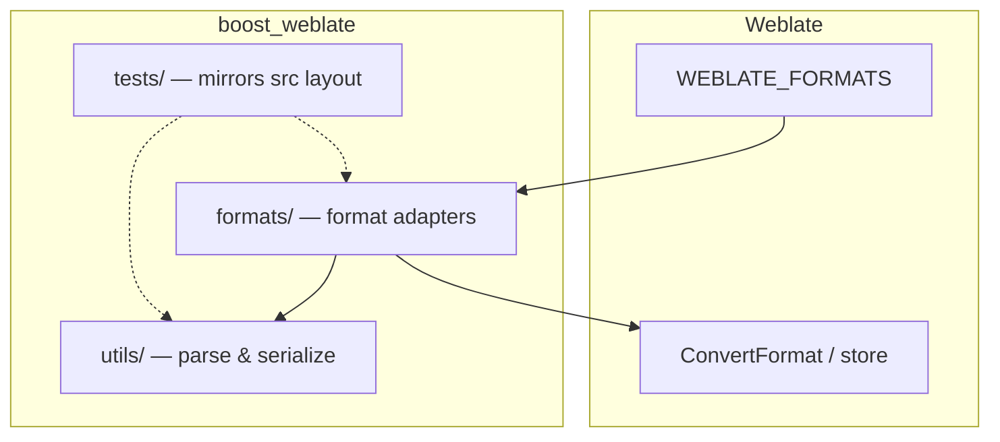

<!--
SPDX-FileCopyrightText: 2026 Andrew Zhang <whisper67265@outlook.com>

SPDX-License-Identifier: BSL-1.0
-->

# cppa-weblate-plugin

## Overview

**cppa-weblate-plugin** is a small Python package (`boost_weblate` on import, `cppa-weblate-plugin` on PyPI) that extends [Weblate](https://weblate.org/) with formats needed for **Boost C++ Libraries** documentation translation. Today it implements **QuickBook** (`.qbk`): a monolingual convert pipeline that extracts translatable prose into Gettext-style workflows and writes translations back into the original template.

**Why a plugin instead of a Weblate fork?** A fork must be rebased across upstream security fixes, releases, and dependency changes. Shipping **stock Weblate** (PyPI or the official image) plus this plugin keeps you on the supported upgrade path while still teaching Weblate how to parse and serialize QuickBook. Customization lives in versioned Python code and a single settings hook, not in a divergent Weblate tree.

**Supported formats**

| Format     | Module | Status   |
| ---------- | ------ | -------- |
| QuickBook  | `boost_weblate.formats.quickbook` | Implemented |

Additional formats should follow the same split: a thin class under `src/boost_weblate/formats/` that plugs into Weblate’s format APIs, with parsing and reconstruction under `src/boost_weblate/utils/`.

## Quickstart

Clone the repository, create a local virtual environment with [uv](https://docs.astral.sh/uv/), activate it, and install the package in editable mode with development dependencies (hook runner and test tooling):

```bash
git clone https://github.com/cppalliance/cppa-weblate-plugin.git
cd cppa-weblate-plugin
uv venv
source .venv/bin/activate
# Windows (PowerShell): .venv\Scripts\Activate.ps1
uv pip install -e '.[dev]'
```

Run the test suite:

```bash
pytest
```

Run with the same coverage gate as CI (terminal + XML + HTML, 90% minimum on `boost_weblate`):

```bash
pytest -v --tb=short \
  --cov=boost_weblate \
  --cov-report=term-missing \
  --cov-report=xml:coverage.xml \
  --cov-report=html:htmlcov \
  --cov-fail-under=90
coverage report
```

(`coverage.xml`, `htmlcov/`, and `.coverage` are gitignored; open `htmlcov/index.html` locally to browse line coverage.)

Run the same checks CI uses (lint, reuse, workflow lint, and pytest via [prek](https://pypi.org/project/prek/) reading `.pre-commit-config.yaml`):

```bash
prek run --all-files --show-diff-on-failure
```

Install Git hooks so those checks run on each commit:

```bash
prek install
```

**Alternative with uv groups:** if you prefer a project-local environment managed entirely by uv, `uv sync --group pre-commit` installs the hook runner and pytest into the uv environment; then use `uv run --only-group pre-commit prek run --all-files --show-diff-on-failure` and `uv run --only-group pre-commit prek install`. If you use the classic `pre-commit` CLI instead of prek, install it separately and run `pre-commit install` after syncing dependencies.

## Architecture

Weblate discovers formats by **import path** (see [WEBLATE_FORMATS config](#weblate_formats-configuration)). This repository keeps a clear boundary between “what Weblate sees” and “how a file format works.”



- **`src/boost_weblate/formats/`** — Weblate-facing **format classes** (subclasses of Weblate’s `BaseFormat` family, such as `weblate.formats.convert.ConvertFormat`). `QuickBookFormat` follows the same pattern as built-in convert formats (for example AsciiDoc): it turns a template file into a translation store and, on save, applies translations back using the template plus the store.

- **`src/boost_weblate/utils/`** — **Format-specific logic** with no Weblate import cycle: QuickBook parsing, segment extraction, translate-toolkit storage (`QuickBookFile` / `QuickBookUnit`), and reconstruction (`QuickBookTranslator`). New formats should add a sibling module (or package) here.

- **`tests/`** — **Pytest** layout mirrors `src/boost_weblate/` (`tests/formats/`, `tests/utils/`, `tests/endpoint/`). Shared fixtures live under `tests/fixtures/`. `tests/conftest.py` configures `sys.path`, sets `DJANGO_SETTINGS_MODULE` to `tests.django_qbk_format_settings`, and calls `django.setup()` so format tests can load Weblate’s Django stack without requiring PostgreSQL.

## WEBLATE_FORMATS configuration

Weblate discovers formats from the `WEBLATE_FORMATS` setting (see `FileFormatLoader` in upstream `weblate.formats.models`). The official Docker image evaluates a single optional file after base settings: if `/app/data/settings-override.py` exists, it is compiled and executed with `exec()` in the **same namespace** as the rest of `weblate.settings_docker`.

Stock `weblate.settings_docker` does **not** always bind `WEBLATE_FORMATS` in that namespace before the hook runs, so a bare `WEBLATE_FORMATS += (...)` in the override can raise `NameError`. This repository ships ``src/boost_weblate/settings_override.py`` as the Docker ``exec()`` fragment: it assigns ``WEBLATE_FORMATS`` by **reading** upstream ``weblate/formats/models.py`` and regex-slicing ``FormatsConf.FORMATS`` (aligned with the installed Weblate version without importing ``weblate.formats.models`` during settings load, which can raise ``AppRegistryNotReady``). It appends the endpoint Django app via ``INSTALLED_APPS += ("boost_weblate.endpoint.apps.BoostEndpointConfig",)``. If you also set ``WEBLATE_ADD_APPS`` to the same app, remove one source to avoid duplicate ``INSTALLED_APPS`` entries.

**Operators:** ensure the plugin package is installed in the Weblate environment (`pip` / image layer), then install the override file where Weblate expects it. For the stock Docker layout:

```dockerfile
COPY settings-override.py /app/data/settings-override.py
```

That path is fixed; Weblate does not scan `DATA_DIR` for arbitrary override files. The override file is **not** the same as `WEBLATE_PY_PATH` / `python/customize` (importable customization on `sys.path`); for format registration, use this exec hook unless your image explicitly imports another settings module. See the comments in `settings_override.py` for the full distinction.

**Adding another format:** implement the class under `boost_weblate/formats/`, append its dotted class path in ``weblate_formats_with_quickbook()`` (or extend the tuple built there), redeploy, and restart Weblate. If upstream changes the layout of ``FormatsConf`` in ``models.py``, update the regex in ``settings_override.py`` accordingly.

## Contributing

- **Hooks:** use prek (or classic pre-commit) with `.pre-commit-config.yaml` so local runs match CI (Ruff, YAML/TOML checks, REUSE, actionlint, pytest).

- **Tests:** add tests next to the code you touch (`tests/formats/`, `tests/utils/`, or `tests/endpoint/`). Keep `django.setup()`-friendly patterns; heavy DB or migration suites are intentionally avoided in the bundled Django test settings.

- **CI coverage:** the *Lint and format* workflow runs a **Tests and coverage** job that prints `term-missing` output, runs `coverage report`, writes `coverage.xml` and `htmlcov/`, and uploads those plus `.coverage` as a workflow artifact (download from the run’s *Artifacts* section on GitHub). Coverage is configured in `pyproject.toml` (`[tool.coverage.*]`); the job uses `uv sync --frozen --group dev --group pre-commit` so `pytest-cov` and `coverage[toml]` match the lockfile.

- **Pull requests:** open PRs against the default branch on GitHub. Keep changes focused; ensure CI is green (build/wheel checks, lint, tests). Respond to review feedback on the PR thread; for design questions or bug reports, use [Issues](https://github.com/cppalliance/cppa-weblate-plugin/issues).

## License

This plugin is BSL-licensed; when used with Weblate, Weblate's GPLv3 license applies to the combined deployment. See `LICENSE` for the Boost Software License text.
