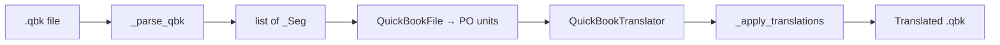

<!--
SPDX-FileCopyrightText: 2026 Andrew Zhang <whisper67265@outlook.com>

SPDX-License-Identifier: BSL-1.0
-->

# QuickBook Grammar Reference (cppa-weblate-plugin)

This document describes the **QuickBook extraction grammar** implemented by
cppa-weblate-plugin. It maps QuickBook syntax to parser behavior in
[`src/boost_weblate/utils/quickbook.py`](../src/boost_weblate/utils/quickbook.py).

The plugin is **not** a validating QuickBook compiler. It is a **segment
extractor**: it walks `.qbk` text, finds translatable prose spans, exposes them
as Weblate/PO units, and reconstructs files by offset replacement. Anything not
listed under [Supported Constructs](#supported-constructs) is copied verbatim.

For the canonical QuickBook language specification, see the official Boost
documentation:

- [Quick Reference](https://www.boost.org/doc/libs/latest/doc/html/quickbook/ref.html)
- [Block Level Elements](https://www.boost.org/doc/libs/latest/doc/html/quickbook/syntax/block.html)
- [Phrase Level Elements](https://www.boost.org/doc/libs/latest/doc/html/quickbook/syntax/phrase.html)

## Architecture



The Weblate adapter ([`src/boost_weblate/formats/quickbook.py`](../src/boost_weblate/formats/quickbook.py))
delegates all syntax handling to the utils module.

### Parser functions

| Function / class | Role |
| ---------------- | ---- |
| `_find_bracket_end` | Locates the closing `]` for a `[` block; handles nested brackets, `'''` raw escapes, and `\[` `\]` backslash escapes |
| `_parse_bracket_keyword` | Extracts the keyword or sigil (`h2`, `section`, `@`, `#`, `:`, etc.) and the content-start offset |
| `_has_prose` | Returns whether stripped text contains translatable prose (excludes `__macro__`-only text) |
| `_clean_cell_text` | Normalizes table/variablelist cell text: strips ` ``` ` fences, joins soft-wrapped lines |
| `_extract_fence_content_segs` | Extracts translatable content from ` ``` ` code fences inside table cells that have no prose |
| `_parse_table_inner` | Parses `[table ...]` and `[variablelist ...]` titles and `[[cell]]` rows |
| `_parse_qbk` | Main recursive parser: skips non-translatable blocks, extracts segments, recurses into nested bodies (depth ≤ 10) |
| `_apply_translations` | Rebuilds the file by replacing each segment via a callback; preserves all other bytes |
| `QuickBookFile.parse` | Converts `_Seg` list into translate-toolkit units with location and `type:` notes |
| `QuickBookTranslator` | Wires `_apply_translations` to a PO store lookup |

Grammar constants in the source (`_SKIP_KEYWORDS`, `_SKIP_SINGLE_CHARS`,
`_HEADING_KEYWORDS`, `_ADMONITION_KEYWORDS`, `_PARA_BREAK_KEYWORDS`) define
which bracket keywords are skipped, extracted, or terminate paragraph collection.

---

## Supported Constructs

Each row maps a QuickBook construct to the handler that processes it and the
segment metadata assigned to extracted units.

| Construct | Syntax example | Parser handler | Segment type / context | Notes |
| --------- | -------------- | -------------- | ---------------------- | ----- |
| Paragraph | `This is prose with soft-wrapped\ncontinuation lines.` | `_parse_qbk` (paragraph loop), `_has_prose` | `paragraph` / `paragraph` | Soft-wrapped lines are joined with spaces in the msgid; original newlines preserved on identity round-trip |
| Paragraph with inline markup | `See [@https://example.com RFC] and [link id `text`].` | `_parse_qbk`, `_has_prose` | `paragraph` / `paragraph` | Inline `[@url]`, `[link ...]`, `[*bold]`, etc. kept verbatim in msgid |
| Unordered list | `* First item\n* Second item` | `_parse_qbk` | `list` / `list` | Detected when first non-whitespace character is `*`; msgid preserves original line breaks |
| Ordered list | `# First step\n# Second step` | `_parse_qbk` | `list` / `list` | Detected when first non-whitespace character is `#` |
| Heading h1–h6 | `[h2 Section title]` | `_parse_qbk` + `_HEADING_KEYWORDS` | `heading` / `heading 2` (etc.) | `no_wrap=True` |
| Generic heading | `[heading Custom title]` or `[heading:id Custom title]` | `_parse_qbk` + `_HEADING_KEYWORDS` | `heading` / `heading` | ID after `:` is part of bracket syntax, not extracted separately |
| Section title (single-line) | `[section:intro Introduction]` | `_parse_qbk` (`kw == "section"`) | `section-title` / `section title` | Title text only; `[endsect]` is skipped |
| Section title (multi-line) | `[section:body Title line\n\nBody content...]` | `_parse_qbk` (recursive) | `section-title` + nested types | First line is title; body parsed recursively |
| Nested section content | Paragraphs, headings, etc. inside `[section ...]` | `_parse_qbk` (`_depth + 1`) | various | Recursion capped at depth 10 |
| Admonition (single-line) | `[warning One-line warning text.]` | `_parse_qbk` + `_ADMONITION_KEYWORDS` | `admonition` / `warning` (etc.) | Keywords: `note`, `warning`, `tip`, `caution`, `important`, `blurb` |
| Admonition (multi-line) | `[note\nFirst paragraph.\n\nSecond paragraph.\n]` | `_parse_qbk` (recursive) | `paragraph`, etc. | Body parsed as nested content |
| Blockquote (single-line) | `[:Quoted text here.]` | `_parse_qbk` (`kw == ":"`) | `blockquote` / `blockquote` | Sigil `:` parsed by `_parse_bracket_keyword` |
| Blockquote (multi-line) | `[:Line one.\nLine two.\n]` | `_parse_qbk` (recursive) | `paragraph`, etc. | |
| Table title | `[table Message patterns\n[[col1][col2]]...]` | `_parse_table_inner` | `table-title` / `table title` | First non-bracket line after `[table` |
| Table prose cell | `[[Cell text with prose.][Another cell.]]` | `_parse_table_inner`, `_clean_cell_text`, `_has_prose` | `table` / `table cell` | `no_wrap=True`; blank lines become `\n\n` in msgid |
| Table code-fence cell | `[[__macro__][\n    ```\n    template<class T>\n    class foo;\n    ```\n]]` | `_extract_fence_content_segs` | `table` / `table code` | Extracted only when cell has no prose outside fences |
| Variable list title | `[variablelist FAQ\n[[question][answer]]...]` | `_parse_table_inner` | `variablelist-title` / `variablelist title` | Same row/cell parser as tables |
| Variable list cell | `[[ "Question?" ][ Answer prose. ]]` | `_parse_table_inner` | `variablelist` / `variablelist cell` | |

### Syntax examples (from test fixture)

**Section and paragraph with inline links** (from
[`tests/fixtures/quickbook_fixture.qbk`](../tests/fixtures/quickbook_fixture.qbk)):

```qbk
[section:complex_fixture Complex QuickBook test fixture]

This opening paragraph soft-wraps onto a second line while keeping an
inline [@https://example.com/path RFC-style link] and a named
[link beast.ref.boost__beast__http__message `message`] reference in the
same paragraph block.
```

**Table with prose and code-fence cells:**

```qbk
[table Message patterns
[[Name][Description]]
[[Plain prose cell][
    This cell has human-readable text only, without a code fence.
]]
]
```

---

## Inline and Pass-Through Markup

The parser has **no dedicated inline (phrase-level) parser**. Inline elements are
preserved verbatim inside extracted paragraph, list, heading, and table-cell
msgids. Translators must keep them intact.

| Inline element | Example | Behavior |
| -------------- | ------- | -------- |
| Bold | `[*bold text]` or `*bold*` | Pass-through in parent msgid |
| Italic | `['italic text]` or `/italic/` | Pass-through |
| URL | `[@https://example.com link text]` | Pass-through when inline in prose |
| Internal link | `[link section.anchor `link text`]` | Pass-through when inline in prose |
| API references | `[funcref ns::func `text`]`, `[classref ...]`, etc. | Pass-through when inline; **standalone block lines skipped** |
| Macro expansion | `__macro_name__` | Pass-through; lines containing only macros are **not** extracted as prose (`_QBK_MACRO_ONLY_RE`) |
| Raw escape | `'''no processing'''` | Skipped as a block region; also handled inside `_find_bracket_end` |

**Standalone vs inline:** A `[link ...]` or `[@url ...]` on its own line as a
block opener is skipped (`_SKIP_KEYWORDS` / `_SKIP_SINGLE_CHARS`). The same
markup embedded in a paragraph or list item is kept in the extracted msgid.

---

## Unsupported / Intentionally Skipped Constructs

These constructs are recognized (or encountered) but **not extracted** as
translation units. They are copied character-for-character during reconstruction.

| Construct | Syntax example | Handler | Rationale |
| --------- | -------------- | ------- | --------- |
| Comment | `[/ Copyright notice ...]` | `_SKIP_KEYWORDS` (`"/"`) | Not user-facing prose |
| Include | `[include other.qbk]` | `_SKIP_KEYWORDS` | Structural; content extracted only if Weblate processes the included file separately |
| Import | `[import file.qbk]` | `_SKIP_KEYWORDS` | Pulls templates/macros into scope at build time |
| XInclude | `[xinclude ...]` | `_SKIP_KEYWORDS` | External XML inclusion |
| Macro definition | `[def __name__ replacement]` | `_SKIP_KEYWORDS` | Build-time text substitution |
| Template definition | `[template name[args] body]` | `_SKIP_KEYWORDS` | Boilerplate generator, not natural-language prose |
| QuickBook version | `[quickbook 1.7]` | `_SKIP_KEYWORDS` | Document metadata |
| Section end | `[endsect]` | `_SKIP_KEYWORDS` | Structural delimiter |
| Preformatted block | `[pre formatted text]` | `_SKIP_KEYWORDS` | Code-like content, not prose |
| Line break | `[br]` | `_SKIP_KEYWORDS` | Formatting directive |
| Conditional | `[? symbol text]`, `[if sym]`, `[elif sym]`, `[else]`, `[endif]` | `_SKIP_SINGLE_CHARS` (`"?"`) / `_SKIP_KEYWORDS` | Build-time feature flags |
| Anchor | `[#anchor_id]` | `_SKIP_SINGLE_CHARS` (`"#"`) | Navigation ID, not prose |
| Image | `[$path/to/image.png [width 100px]]` | `_SKIP_SINGLE_CHARS` (`"$"`) | Asset reference |
| Standalone URL block | `[@https://example.com]` on its own line | `_SKIP_SINGLE_CHARS` (`"@"`) | Block-level skip; inline URLs in prose are kept |
| Source-mode block | `[c++]`, `[python]`, `[ruby]`, `[teletype]`, `[xml]`, `[javascript]` | `_SKIP_KEYWORDS` | Switches syntax highlighting mode |
| Standalone reference blocks | `[funcref ...]`, `[classref ...]`, `[memberref ...]`, `[enumref ...]`, `[macroref ...]`, `[conceptref ...]`, `[headerref ...]`, `[globalref ...]`, `[link ...]` | `_SKIP_KEYWORDS` | API identifiers; inline refs in prose are kept |
| Indented code block | `    int main() { }` (leading space/tab) | `_parse_qbk` (indent skip loop) | Source code, not translatable prose |
| Raw-escape region | `'''escaped text'''` | `_parse_qbk` (triple-quote skip) | No QuickBook processing inside |
| Unrecognized block commands | `[article Title]`, `[library Boost.Asio ...]`, `[fig ...]`, `[footnote ...]` | `_parse_qbk` (fall-through `continue`) | Not in supported keyword sets; body not extracted |
| Macro-only lines | `__message__, __fields__` | `_has_prose` / `_QBK_MACRO_ONLY_RE` | No human-readable text outside macros |
| Empty section body | `[section\n\n]` | `_parse_qbk` | No translatable content |
| Deep nesting | Sections nested more than 10 levels | `_parse_qbk` (`_depth > 10`) | Guard against pathological input and worker timeouts |

---

## Translation Extraction Rules

### When text becomes a unit

1. **Paragraphs:** Non-indented lines collected until a blank line, indented
   line, `'''` line, or paragraph-break keyword/sigil block. `_has_prose` must
   return true (text exists outside bracket markup and is not macro-only).

2. **Lists:** Same collection rules; first non-whitespace character `*` or `#`
   sets segment type to `list`. The msgid keeps original newlines (not
   space-joined like paragraphs).

3. **Soft-wrap joining:** For paragraphs, consecutive non-blank lines are joined
   with spaces in the msgid. On identity round-trip (`translation == msgid`),
   `_apply_translations` restores the original file span including newlines.

4. **Table cells:** `_clean_cell_text` strips ` ``` ` fence regions for prose
   detection. If prose remains, the cell is one unit. If not, `_extract_fence_content_segs`
   may extract code inside fences as separate units (`context: table code` or
   `variablelist code`).

5. **`no_wrap` flag:** Set for headings, section titles, table titles, table/variablelist
   cells, and fence code segments. Affects how translators should treat line breaks
   in the Weblate UI (stored in segment metadata).

### Reconstruction

`_apply_translations` sorts segments by offset and replaces each span with the
callback result. Non-translatable regions (brackets, code blocks, skipped blocks)
are never modified. Trailing newlines on spans are preserved.

### PO unit metadata

`QuickBookFile.parse` creates units with:

- **Location:** `{filename}:{line}` (1-based line of the segment start)
- **Developer note:** `type: {context}` (e.g. `type: paragraph`, `type: table code`)
- **Docpath:** `qbk:{index}`

---

## Parser Limitations

| Limitation | Detail |
| ---------- | ------ |
| Not a validating parser | Malformed QuickBook does not produce errors; behavior is best-effort |
| Unclosed brackets | Line with unclosed `[` is skipped inside blocks or absorbed into paragraph collection |
| Unrecognized blocks | `[article]`, `[library]`, `[fig]`, `[footnote]`, etc. — entire block body ignored for extraction |
| Include indirection | Strings in `[include]`d files are invisible unless those `.qbk` files are separate Weblate components |
| Inline-only refs | Standalone `[link ...]` lines in tables/lists are skipped; only inline-in-prose refs appear in msgids |
| Recursion depth | Maximum 10 nested `_parse_qbk` calls; deeper content produces no segments |
| Performance | Single O(n) scan with recursion; no parser benchmarks for large files exist yet |
| Module docstring nuance | The source docstring says fence-only table cells are non-translatable; in practice `_extract_fence_content_segs` **does** extract code inside ` ``` ` fences when the cell has no prose |

---

## Coverage Matrix

Comparison of Boost QuickBook 1.7 constructs (per
[official quick reference](https://www.boost.org/doc/libs/latest/doc/html/quickbook/ref.html))
against this plugin.

**Support levels:** **Full** = extracted as intended; **Partial** = only inline,
nested, or special-case extraction; **None** = skipped verbatim.

| Construct | Official syntax | Support | Handler / reason |
| --------- | --------------- | ------- | ---------------- |
| Article | `[article Title]` | None | Unrecognized block; title not extracted |
| Library metadata | `[library Name [quickbook 1.7] ...]` | None | Unrecognized block |
| QuickBook version | `[quickbook 1.7]` | None | `_SKIP_KEYWORDS` |
| Section | `[section:id Title]` | Full | `_parse_qbk` → `section-title` + recursive body |
| End section | `[endsect]` | None | `_SKIP_KEYWORDS` |
| Paragraph | Plain text, blank-line terminated | Full | `_parse_qbk` paragraph loop |
| Unordered list | `* item` | Full | `_parse_qbk` list detection |
| Ordered list | `# item` | Full | `_parse_qbk` list detection |
| Heading | `[h1]`–`[h6]`, `[heading]` | Full | `_HEADING_KEYWORDS` |
| Blockquote | `[: text]` | Full | `kw == ":"` |
| Admonitions | `[note]`, `[warning]`, `[tip]`, `[caution]`, `[important]`, `[blurb]` | Full | `_ADMONITION_KEYWORDS` |
| Table | `[table Title [[cell]...]]` | Full | `_parse_table_inner` |
| Variable list | `[variablelist Title [[q][a]]]` | Full | `_parse_table_inner` |
| Preformatted | `[pre text]` | None | `_SKIP_KEYWORDS` |
| Indented code | Leading space/tab | None | Indent skip in `_parse_qbk` |
| Code fence | ` ``` code ``` ` | Partial | Extracted only inside table cells via `_extract_fence_content_segs`; not extracted in body text |
| Comment | `[/ comment]` | None | `_SKIP_KEYWORDS` |
| Include | `[include file.qbk]` | None | `_SKIP_KEYWORDS` |
| Import | `[import file]` | None | `_SKIP_KEYWORDS` |
| Def (macro) | `[def id text]` | None | `_SKIP_KEYWORDS` |
| Template | `[template name[args] body]` | None | `_SKIP_KEYWORDS` |
| Conditionals | `[? sym]`, `[if]`, `[elif]`, `[else]`, `[endif]` | None | `_SKIP_KEYWORDS` / `_SKIP_SINGLE_CHARS` |
| Anchor | `[#id]` | None | `_SKIP_SINGLE_CHARS` |
| Image | `[$path]` | None | `_SKIP_SINGLE_CHARS` |
| URL | `[@url text]` | Partial | Inline in prose: pass-through; standalone block: skipped |
| Link | `[link id text]` | Partial | Inline: pass-through; standalone block: `_SKIP_KEYWORDS` |
| API refs | `[funcref]`, `[classref]`, etc. | Partial | Inline: pass-through; standalone block: `_SKIP_KEYWORDS` |
| Bold / italic / underline | `[*b]`, `['i]`, `[_u]` | Partial | Pass-through inside extracted msgids only |
| Teletype | `[^tt]`, `=tt=` | Partial | Pass-through inside extracted msgids |
| Strikethrough | `[-s]` | Partial | Pass-through inside extracted msgids |
| Replaceable | `[~r]` | Partial | Pass-through inside extracted msgids |
| Inline code | `` `code` `` | Partial | Pass-through inside extracted msgids |
| Raw escape | `'''text'''` | None | Skipped as block region |
| Line break | `[br]` | None | `_SKIP_KEYWORDS` |
| Source mode | `[c++]`, `[python]`, etc. | None | `_SKIP_KEYWORDS` |
| Figure | `[fig diagram.png..Architecture overview..lib.diagram]` | None | Unrecognized block |
| Footnote | `[footnote [content]]` | Partial | Inline footnote markup in prose is pass-through; block `[footnote]` not supported |
| XInclude | `[xinclude]` | None | `_SKIP_KEYWORDS` |
| Role | `[role name text]` | Partial | Pass-through if inline; no block handler |

---

## Real-World Validation

Three representative Boost library `.qbk` files were fetched from boostorg GitHub
(2026-06-17) and analyzed with `_parse_qbk`. Source URLs:

| Library | File | URL |
| ------- | ---- | --- |
| Boost.Beast | `doc/qbk/04_http/02_message.qbk` | https://raw.githubusercontent.com/boostorg/beast/develop/doc/qbk/04_http/02_message.qbk |
| Boost.Asio | `doc/overview.qbk` | https://raw.githubusercontent.com/boostorg/asio/develop/doc/overview.qbk |
| Boost.Spirit | `doc/introduction.qbk` | https://raw.githubusercontent.com/boostorg/spirit/develop/doc/introduction.qbk |

### Segment extraction summary

| File | Lines | Segments extracted | Segment types |
| ---- | ----- | ------------------ | ------------- |
| Beast `02_message.qbk` | 236 | 53 | section-title (1), paragraph (8), heading (2), table-title (4), table cell (30), table code (8) |
| Asio `overview.qbk` | 167 | 15 | section-title (4), list (11) |
| Spirit `introduction.qbk` | 206 | 58 | section-title (1), paragraph (23), list (5), heading (2), table-title (2), table cell (25) |

### Construct usage vs extraction

| Construct | Beast | Asio | Spirit | Extracted? |
| --------- | ----- | ---- | ------ | ---------- |
| `[/ comment]` | Yes | Yes | Yes | No (skipped) |
| `[section]` | Yes | Yes (4) | Yes | Yes (title only; body recursed) |
| `[endsect]` | Yes | Yes | Yes | No |
| `[heading]` / `[hN]` | Yes (2) | No | Yes (2) | Yes |
| Paragraphs with inline `[@url]`, `[link]` | Yes | No (lists only) | Yes | Yes (inline preserved) |
| `[table]` | Yes (5) | No | Yes (2) | Yes (title, cells, fence code) |
| `[include]` | No | Yes (41) | No | No — **included file content not in this file** |
| `[link ...]` standalone in lists | No | Yes (94 inline in lists) | Yes (2 inline) | Yes (as list items with inline markup) |
| `[link ...]` standalone block | Yes (3 in table cells) | No | No | No (skipped in cells without prose) |
| Indented code blocks | Yes (~88 lines) | Yes (~55 lines) | Yes (~56 lines) | No |
| `__macro__` expansions | Yes (`__message__`, etc.) | No | Yes (`__spirit__`, `__qi__`, etc.) | Partial (pass-through in prose; macro-only cells skipped) |
| `[$ image]` | Yes (1) | No | No | No |
| `[fig ...]` | No | No | Yes (2) | No (unrecognized) |
| `[footnote ...]` | No | No | Yes (1 inline) | Partial (inline in paragraph pass-through) |
| `[def]` / `[template]` | No in this file | Yes in root `asio.qbk` | No | No |

### High-impact gaps for Boost translation workflows

1. **`[include]` chains (Asio):** `overview.qbk` is primarily a table of contents
   built from 41 `[include]` directives. Prose lives in included files; translators
   must have those `.qbk` files registered as separate Weblate template sources.

2. **Root metadata files (`asio.qbk`):** Boost libraries often declare `[library ...]`,
   `[quickbook 1.7]`, `[def ...]`, and `[template ...]` in a root file. None of
   these are extracted. This is intentional — they are build-time scaffolding.

3. **`[fig]` blocks (Spirit):** Figure captions and IDs in `[fig ...]` blocks are
   not extracted. Spirit uses figures for architecture diagrams.

4. **Table cells with only `[link]` + code fence (Beast):** Cells containing
   `__macro__` or bare `[link ...]` without prose skip the link text; fence code
   is extracted separately as `table code` units (8 segments in Beast message doc).

5. **`[article]` / `[library]` titles:** Common document roots (see Weblate upstream
   test `cs.qbk` in [`tests/formats/test_quickbook.py`](../tests/formats/test_quickbook.py))
   are not extracted. Only inner sections and prose are.

### Validation method

Analysis was performed ephemerally (files not committed to the repository):

1. Download `.qbk` files via `curl` from boostorg GitHub `develop` branches.
2. Scan bracket keywords with `_parse_bracket_keyword` and `_find_bracket_end`.
3. Run `_parse_qbk` and count segment types and contexts.
4. Cross-check against manual inspection of construct usage.

To reproduce locally:

```bash
curl -sL -o /tmp/beast.qbk \
  https://raw.githubusercontent.com/boostorg/beast/develop/doc/qbk/04_http/02_message.qbk
PYTHONPATH=src python3 -c "
from pathlib import Path
from boost_weblate.utils.quickbook import _parse_qbk
segs = _parse_qbk(Path('/tmp/beast.qbk').read_text())
print(len(segs), {s.context for s in segs})
"
```

---

## Related Tests

| Test file | Coverage |
| --------- | -------- |
| [`tests/utils/test_quickbook.py`](../tests/utils/test_quickbook.py) | Parser unit tests: brackets, tables, sections, paragraphs, depth cap |
| [`tests/fixtures/quickbook_fixture.qbk`](../tests/fixtures/quickbook_fixture.qbk) | Synthetic fixture with Beast-inspired patterns |
| [`tests/formats/test_quickbook.py`](../tests/formats/test_quickbook.py) | Weblate `QuickBookFormat` integration; upstream `cs.qbk` patterns |
| [`tests/plugin/test_functional.py`](../tests/plugin/test_functional.py) | Docker E2E QuickBook round-trip |

---

## Source of truth

When this document and the implementation disagree, **`src/boost_weblate/utils/quickbook.py`**
is authoritative. Update this document when parser behavior changes.
